BCG UNIMI - Advanced genomics class 2021 

Chiara Paleni

## 1. Introduction 
TnSeq is a technique for studying gene function and molecular interactions. This project is based on the work of van Opijnen, Bodi, and Camilli of 2009, *Tn-seq: high-throughput parallel sequencing for fitness and genetic interaction studies in microorganisms* (https://doi.org/10.1038/nmeth.1377).
In this work, a *S. pneumoniae* culture was transformed with the *magellan6* transposon, containing a drug resistence gene and the MmeI restriction site. This transposon inserts randomly in the gene and thus a library of transposon insertions is created. Since transposition is a rare event, each bacterium will carry a single insertion. We can monitor where insertions happened with targeted PCR amplification and sequencing thanks to the MmeI site: the fragments obtained will contain a 20bp sequence belonging to the bacterium corresponding to the insertion point, thus the position of the insertion can be found by mapping the reads on the genome. 
Then, the library is grown in a medium that selects for the drug resistence, so that only bacteria containing the transposon will be able to grow. However, if the insertion has a negative effect on fitness, meaning the gene that was disrupted by the insertion has a positive effect on bacterial growth, the number of reads mapping on that gene will be lower in this second read set than in the first one. Similarly, if the insertion has a positive effect, the number of reads will be higher, and if the gene is essential, the number of reads will be close to 0.  
We can then compute an average fitness for the insertion by comparing the number of reads at two different time points.


Then we can compute an average fitness value for each gene with a weighted average of the fitness of all insertions that fall within that gene. The paper defines four types of genes according to fitness:  
- neutral (fitness = 0.96–1.04)  
- advantageous (fitness > 1.04)  
- disadvantageous (fitness < 0.96)  
- possibly essential (fitness = 0)  
  
Let us take a look at the fitness values. For each gene we define the genomic coordinate as the middle point between the start and the end of the gene.


```r
#code from Brilli M.
fData<-read.delim("Tn_seq_fitness_data_Opijnen_et_al_2009.txt",header=TRUE,stringsAsFactors = FALSE,sep = "\t")
geneCoord<-read.delim("GCF_000006885.1_ASM688v1_genomic_olt.txt",header=FALSE,stringsAsFactors = FALSE,sep = "\t")
#matching genes to genomic coordinates
m<-match(fData$locus,geneCoord$V1)
w<-which(is.na(m))
fData<- fData[-w,]
m<-m[-w]
geneCoord<-geneCoord[m,]
library(ggplot2)
#define a new dataframe for simplicity
gen_coords<-(geneCoord$V2[fData$average_fitness!=0]+geneCoord$V3[fData$average_fitness!=0])/2
fit<-fData$average_fitness[fData$average_fitness!=0]
#own code
fitness_by_coord<-data.frame("genomic coordinates"=gen_coords,"avg gene fitness"=fit)
fitness_by_coord$type <- cut(fitness_by_coord$avg.gene.fitness,breaks=c(0,0.96,1.04,Inf),
                             labels=c("disadvanteageous","neutral","advantageous"))
library(patchwork)
```

```
## Warning: package 'patchwork' was built under R version 4.0.3
```

```r
library(dplyr)
```

```
## Warning: package 'dplyr' was built under R version 4.0.3
```

```
## 
## Attaching package: 'dplyr'
```

```
## The following objects are masked from 'package:stats':
## 
##     filter, lag
```

```
## The following objects are masked from 'package:base':
## 
##     intersect, setdiff, setequal, union
```

```r
cbbPalette <- c("#000000", "#E69F00", "#56B4E9", "#009E73", "#F0E442", "#0072B2", "#D55E00", "#CC79A7")
#scatterplot+ colored scatterplot based on category
p1<-ggplot(data=fitness_by_coord,aes())+
    geom_point(aes(x=genomic.coordinates, y=avg.gene.fitness))+
    labs(title="fitness by genomic position")+theme_minimal()
p2<-ggplot(data=fitness_by_coord,aes())+
    geom_point(aes(x=genomic.coordinates, y=avg.gene.fitness,color=type),show.legend = F)+
    scale_color_manual(values=c(cbbPalette[7],cbbPalette[1],cbbPalette[3]))+
    labs(title="fitness by genomic position")+theme_minimal()
    #geom_smooth(aes(x=genomic.coordinates, y=avg.gene.fitness),method = "loess")
# bar chart for category
p3<-ggplot(fitness_by_coord)+geom_bar(aes(y=type,fill=type))+scale_fill_manual(values=c(cbbPalette[7],cbbPalette[1],cbbPalette[3]))+theme_minimal()
p1 + p2 + p3 + guide_area() + plot_layout(ncol = 2, guides = "collect")
```

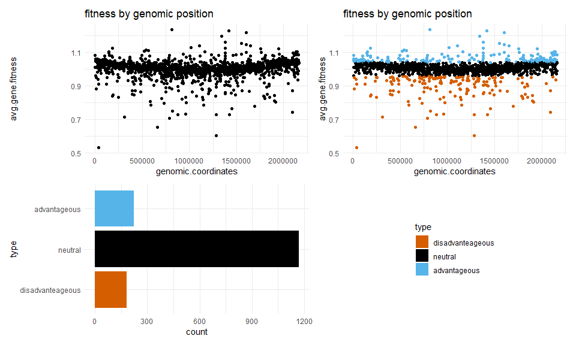<!-- -->


As we expect, most genes fall into the neutral category. However, the fitness values appear to have a trend depending on the position: closer to the origin of replication, the fitness values increase. We will try to quantify and remove this trend, and finally re-evaluate gene fitness.

## 2. Effect estimation

Adding a smoothing function to the plot we can more clearly see the trend.

```r
ggplot(data=fitness_by_coord,aes())+
    geom_point(aes(x=genomic.coordinates, y=avg.gene.fitness))+
    geom_smooth(aes(x=genomic.coordinates, y=avg.gene.fitness),method = "loess")+
    labs(title="fitness by genomic position")+theme_minimal()
```

```
## `geom_smooth()` using formula 'y ~ x'
```

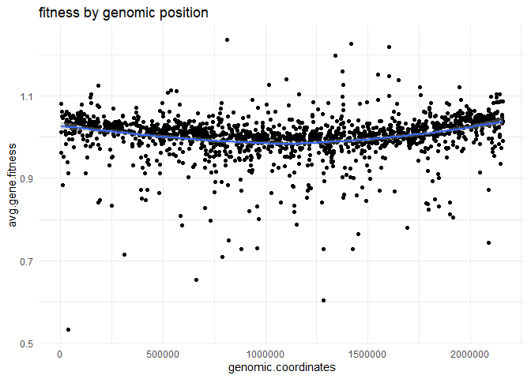<!-- -->

We can analyse this trend by splitting the dataset into windows and computing the mean fitness for each.


```r
window_size<-100000
L<-max(geneCoord$V3)
#defining windows as breaks 
gen_windows<-seq(0,L,window_size)
gen_windows<-c(gen_windows,L)

#assigning every gene its window with the cut function and adding "window" attribute
n_window<-cut(fitness_by_coord$genomic.coordinates,gen_windows)
new_data<-data.frame(fitness_by_coord$avg.gene.fitness,n_window)
colnames(new_data)=c("fitness","window")

#computing mean values by window with summarise
new2<-new_data %>% group_by(window) %>% summarise(avg_fit=mean(fitness))
```

```
## `summarise()` ungrouping output (override with `.groups` argument)
```

```r
#checking how many genes are in each window
count_per_window<-new_data %>% group_by(window) %>% summarise(count_genes=n())
```

```
## `summarise()` ungrouping output (override with `.groups` argument)
```

```r
#i use the middle position of each window for plotting
mid_pos<-gen_windows+window_size/2
mid_pos<-mid_pos[-length(mid_pos)]
new2$mid_pos<-mid_pos
plot(x=new2$window,y=new2$avg_fit)
```

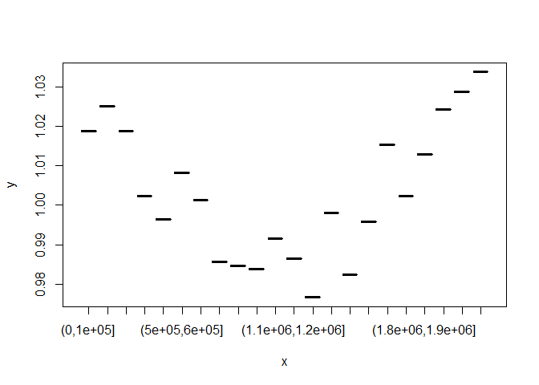<!-- -->

```r
#plot mean values
ggplot(new2,aes(x=mid_pos,y=avg_fit))+geom_point()+
  #ylim(0.5,1.27)+
  geom_smooth()
```

```
## `geom_smooth()` using method = 'loess' and formula 'y ~ x'
```

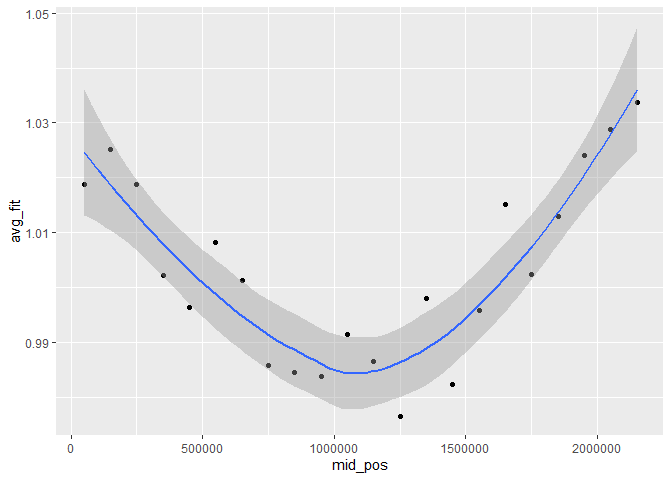<!-- -->

```r
#compare original values, mean over the windows, and smoothing function
ggplot()+geom_point(data=fitness_by_coord,aes(x=genomic.coordinates,y=avg.gene.fitness))+
  geom_line(data=new2,aes(x=mid_pos,y=avg_fit,color="average in 100kbp window"),size=1)+
  geom_smooth(data=fitness_by_coord,aes(x=genomic.coordinates,y=avg.gene.fitness,color="smoothing on original values"),method="loess",size=1)+
  scale_color_manual(values=c("#3366FF","red"))+
  labs(colour="")+
  theme(legend.position = "bottom")
```

```
## `geom_smooth()` using formula 'y ~ x'
```

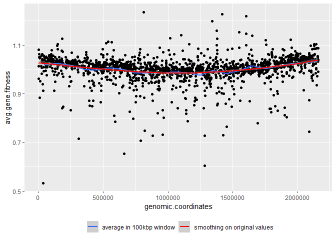<!-- -->

The mean values have the same "smile" trend.
We can analyze this trend by fitting a regression model. Since the data has a smile shape, we have two options:
1. we split the data in two and use one half of the data as a training set and the other as a test set for a simple linear regression model.
2. we fit a model that takes this shape into account and we randomly select the training and test set.

```r
#split the data in two
```
Periodic functions such as sine and cosine are an option for this kind of periodic data. Another option is using a polynomial regression by introducing a quadratic term (in simpler words, using the square of genomic coordinates to achieve a parabola-like shape).

```r
#define train and test datasets
fitness_by_coord$scaled_coord<-fitness_by_coord$genomic.coordinates/1e6
train<-sample(nrow(fitness_by_coord),size =nrow(fitness_by_coord)/2+1)
train<-sort(train)
test<-fitness_by_coord[-train,]
train<-fitness_by_coord[train,]


ggplot(train,aes(x=scaled_coord, y=avg.gene.fitness))+geom_point()+
  labs(title="Training set")
```

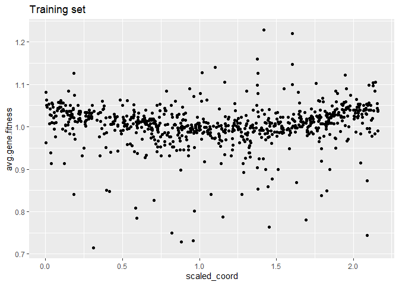<!-- -->

```r
#training the model with a quadratic term of genomic coordinates
mq<-lm(avg.gene.fitness~scaled_coord+I(scaled_coord^2),data=train)
summary(mq)
```

```
## 
## Call:
## lm(formula = avg.gene.fitness ~ scaled_coord + I(scaled_coord^2), 
##     data = train)
## 
## Residuals:
##       Min        1Q    Median        3Q       Max 
## -0.294936 -0.010180  0.006864  0.019693  0.233871 
## 
## Coefficients:
##                    Estimate Std. Error t value Pr(>|t|)    
## (Intercept)        1.032324   0.005462 188.985  < 2e-16 ***
## scaled_coord      -0.084987   0.011443  -7.427 2.91e-13 ***
## I(scaled_coord^2)  0.040951   0.005077   8.065 2.74e-15 ***
## ---
## Signif. codes:  0 '***' 0.001 '**' 0.01 '*' 0.05 '.' 0.1 ' ' 1
## 
## Residual standard error: 0.0493 on 783 degrees of freedom
## Multiple R-squared:  0.07935,	Adjusted R-squared:  0.077 
## F-statistic: 33.74 on 2 and 783 DF,  p-value: 8.759e-15
```

```r
plot(mq)
```

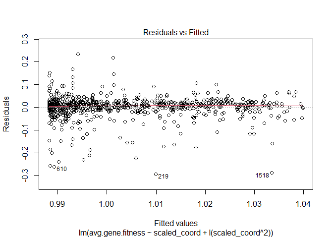<!-- -->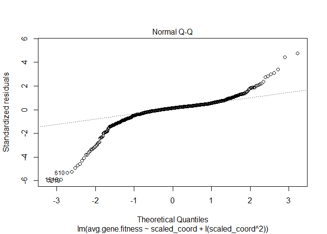<!-- -->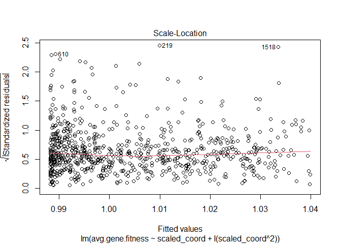<!-- --><!-- -->

```r
ggplot()+geom_point(aes(x=genomic.coordinates,y=avg.gene.fitness),data=train)+
  geom_line(aes(x=train$genomic.coordinates,y=mq$fitted.values,
                color="fitted values"),size=1)+
  labs(colour="")
```

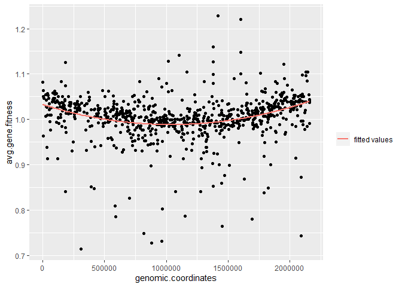<!-- -->

```r
shapiro.test(mq$residuals)
```

```
## 
## 	Shapiro-Wilk normality test
## 
## data:  mq$residuals
## W = 0.79659, p-value < 2.2e-16
```

The model seems to fit nicely. The R-squared statistic is very low, however this is in some part expected, because we have a very important factor affecting the fitness value besides the genomic coordinate, which is of course the real fitness value of the gene. The most important thing to notice is that both terms depending on genomic.coordinates have a low p-value; this means they have a significant effect on the fitness. 
Also, normality assumption on residuals is not respected; again, this is expected, since neither the fitness nor genomic variables were normally distributed to begin with.
However, we just want a model that represents well enough the increasing trend in fitness approaching the origin, and this model seems to do that.
Let us try to fit a trigonometric function. First we will convert the genomic coordinates in radians. Then, we choose the cosine function, since it has higher values at angles 0 and 2 $\Pi$.


```r
train$circular_coords<-train$genomic.coordinates/L*2*pi
mt<-lm(avg.gene.fitness~cos(circular_coords),data=train)
summary(mt)
```

```
## 
## Call:
## lm(formula = avg.gene.fitness ~ cos(circular_coords), data = train)
## 
## Residuals:
##       Min        1Q    Median        3Q       Max 
## -0.301796 -0.010541  0.006669  0.019125  0.234834 
## 
## Coefficients:
##                      Estimate Std. Error t value Pr(>|t|)    
## (Intercept)          1.004343   0.001761 570.400  < 2e-16 ***
## cos(circular_coords) 0.020042   0.002498   8.023 3.75e-15 ***
## ---
## Signif. codes:  0 '***' 0.001 '**' 0.01 '*' 0.05 '.' 0.1 ' ' 1
## 
## Residual standard error: 0.04936 on 784 degrees of freedom
## Multiple R-squared:  0.07588,	Adjusted R-squared:  0.0747 
## F-statistic: 64.37 on 1 and 784 DF,  p-value: 3.75e-15
```

```r
plot(mq)
```

<!-- --><!-- --><!-- -->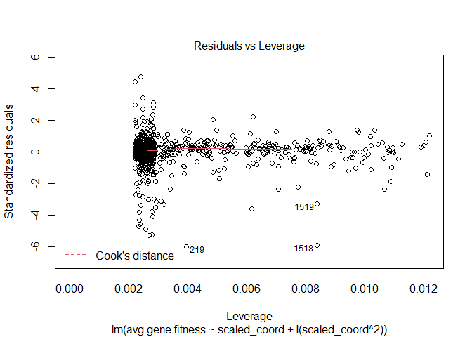<!-- -->

```r
ggplot()+geom_point(aes(x=genomic.coordinates,y=avg.gene.fitness),data=train)+
  geom_line(aes(x=train$genomic.coordinates,y=mt$fitted.values,
                color="fitted values"),size=1)+
  labs(colour="")
```

<!-- -->
Trigonometric functions add a flex point in the trend that is not really visible in the original data, so this might not be the best model. However, the R suqred score is marginally higher.
Another approach we can take is using a non-parametric model such as LOESS. This model does not make any assumptions on the data and performs a local regression (...). This will give us a similar result to what we saw before with the `geom_smooth()` function.


```r
# yp<-predict(m4,newdata=test,se.fit = T)
# plot(test$genomic.coordinates,test$avg.gene.fitness)
# lines(test$genomic.coordinates,yp$fit,col="red")
# yp$residuals<-test$avg.gene.fitness-yp$fit
# plot(yp$residuals)
# 
# fitness_by_coord$predicted<-predict(m4,newdata = fitness_by_coord)
# fitness_by_coord$corrected<-fitness_by_coord$avg.gene.fitness - fitness_by_coord$predicted + 1
# plot(fitness_by_coord$genomic.coordinates,fitness_by_coord$corrected)
# ggplot(fitness_by_coord,aes(x=genomic.coordinates,y=corrected))+geom_point()+geom_smooth(method = "loess")
# fitness_by_coord$newtype <- cut(fitness_by_coord$corrected,breaks=c(0,0.96,1.04,Inf),
#                              labels=c("disadvanteageous","neutral","advantageous"))
# 
# p1<-ggplot(data=fitness_by_coord,aes())+
#     geom_point(aes(x=genomic.coordinates, y=corrected))+
#     labs(title="fitness by genomic position")+theme_minimal()
# p2<-ggplot(data=fitness_by_coord,aes())+
#     geom_point(aes(x=genomic.coordinates, y=corrected,color=newtype),show.legend = F)+
#     scale_color_manual(values=c(cbbPalette[7],cbbPalette[1],cbbPalette[3]))+
#     labs(title="fitness by genomic position")+theme_minimal()
#     #geom_smooth(aes(x=genomic.coordinates, y=avg.gene.fitness),method = "loess")
# 
# p3<-ggplot(fitness_by_coord)+geom_bar(aes(y=newtype,fill=newtype))+scale_fill_manual(values=c(cbbPalette[7],cbbPalette[1],cbbPalette[3]))+theme_minimal()
# p1 + p2 + p3 + guide_area() + plot_layout(ncol = 2, guides = "collect")
```


```r
# l<-max(gen_coords)
# L<-max(geneCoord$V3)
# n<-length(gen_coords)
# library(dplyr)
# window_size<-100000
# start<-seq(0,L,by=window_size/2)
# start<-start[start<=L-window_size]
# end<-start+100000
# window_df<-data.frame(start,end)
# p<-rep(0,length(start))
# check_window<-function(X,w){
#   return(X>w[1] & X<=w[2])
# }
# means<-rep(0,length(start))
# for(i in 1:length(start)){
#   w<-window_df[i,]
#   e<-vapply(X = fitness_by_coord$genomic.coordinates,FUN.VALUE = c(T),FUN = check_window,w=w)
#   means[i]<-mean(fitness_by_coord$avg.gene.fitness[e])
# }
# window_df$mean_fitness<-means
# window_df$mid_pos<-window_df$start+window_size/2
# 
# plot(window_df[,c("mid_pos","mean_fitness")])
# ggplot(window_df,aes(x=mid_pos,y=mean_fitness))+geom_point()+ylim(0.5,1.27)+geom_smooth()
# 
# gen_windows<-seq(0,max(geneCoord$V3),window_size)
# gen_windows<-c(gen_windows,L)
# n_window<-cut(fitness_by_coord$genomic.coordinates,gen_windows)
# new_data<-data.frame(fitness_by_coord$avg.gene.fitness,n_window)
# colnames(new_data)=c("fitness","window")
# new2<-new_data %>% group_by(window) %>% summarise(avg_fit=mean(fitness))
# 
# count_per_window<-new_data %>% group_by(window) %>% summarise(count_genes=n())
# 
# mid_pos<-gen_windows+window_size/2
# mid_pos<-mid_pos[-length(mid_pos)]
# new2$mid_pos<-mid_pos
# plot(x=new2$window,y=new2$avg_fit)
# ggplot(new2,aes(x=mid_pos,y=avg_fit))+geom_point()+ylim(0.5,1.27)+geom_smooth()
```


```r
# l2<-dim(new2)[1]
# #train<-window_df[seq(1,l2/2),]
# #test<-window_df[seq(l2/2+1,l2),]
# 
# train<-sample(nrow(new2),size=nrow(new2)/2)
# test<-new2[-train,]
# train<-new2[train,]
# 
# train<-train[order(train$mid_pos),]
# test<-test[order(test$mid_pos),]
#   
# plot(train$mid_pos,train$avg_fit)
# mid2<-train$mid_pos^2
# 
# 
# m1<-lm(avg_fit~mid_pos+I(mid_pos^2),data=train)
# summary(m1)
# plot(m1)
# plot(x=train$mid_pos,y=train$avg_fit)
# lines(x=train$mid_pos,y=m1$fitted.values,col="red")
# 
# 
# yp<-predict.lm(m1,newdata = test)
# 
# plot(test$mid_pos,test$avg_fit)
# lines(test$mid_pos,yp,col="red")
# 
# 
# m2<-loess(mean_fitness~mid_pos,data=train,span = 1)
# plot(x=train$mid_pos,y=train$mean_fitness)
# lines(x=train$mid_pos,y=m2$fitted,col="red")
# plot(m2$residuals)
# ```
# ```{r}
# fitn2<-fitness_by_coord
# fitn2$mid_pos<-fitn2$genomic.coordinates
# fitn2$predicted<-predict(m1,newdata = fitn2)
# fitn2$corrected<-fitn2$avg.gene.fitness-fitn2$predicted+1
# ggplot(fitness_by_coord,aes(x=genomic.coordinates,y=corrected))+geom_point()+geom_smooth(method = "loess")
# fitn2$newtype <- cut(fitn2$corrected,breaks=c(0,0.96,1.04,Inf),
#                              labels=c("disadvanteageous","neutral","advantageous"))
# 
# ggplot(fitn2,aes(x=genomic.coordinates,y=corrected))+geom_point()+geom_smooth(method = "loess")
# 
# p1<-ggplot(data=fitn2,aes())+
#     geom_point(aes(x=genomic.coordinates, y=corrected))+
#     labs(title="fitness by genomic position")+theme_minimal()
# p2<-ggplot(data=fitn2,aes())+
#     geom_point(aes(x=genomic.coordinates, y=corrected,color=newtype),show.legend = F)+
#     scale_color_manual(values=c(cbbPalette[7],cbbPalette[1],cbbPalette[3]))+
#     labs(title="fitness by genomic position")+theme_minimal()
#     #geom_smooth(aes(x=genomic.coordinates, y=avg.gene.fitness),method = "loess")
# 
# p3<-ggplot(fitn2)+geom_bar(aes(y=newtype,fill=newtype))+scale_fill_manual(values=c(cbbPalette[7],cbbPalette[1],cbbPalette[3]))+theme_minimal()
# p1 + p2 + p3 + guide_area() + plot_layout(ncol = 2, guides = "collect")
```
